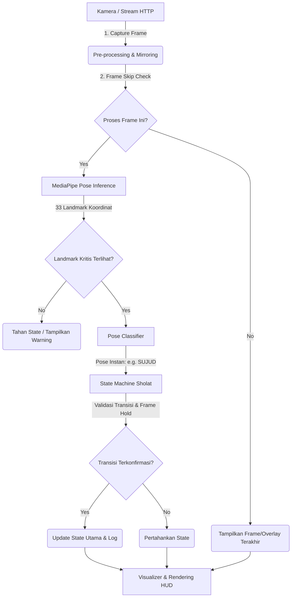

# Panduan Arsitektur & Tuning Sistem — GEMA Imam

Dokumen ini menjelaskan secara detail bagaimana sistem **GEMA Imam** bekerja, alur data dari kamera hingga log file, serta cara Anda melakukan kustomisasi threshold agar sesuai dengan kondisi di lapangan.

---

## 1. Alur Kerja Sistem (Pipeline Data)

Sistem bekerja secara sekuensial pada setiap frame kamera dengan urutan sebagai berikut:

---

## 2. Penjelasan Detail per Modul

### 2.1. Modul Geometri (`pose_utils.py`)
Modul ini bertugas menyederhanakan koordinat 3D MediaPipe menjadi sudut sendi 2D yang mudah dibaca.
*   **`calculate_angle(a, b, c) -> float`**: Menghitung sudut dalam derajat pada sendi `b`. Menggunakan operasi vektor dot product antara garis $\vec{ba}$ dan $\vec{bc}$.
*   **`get_avg_angle(landmarks, idx_a, idx_b, idx_c)`**: Mengambil rata-rata sudut sisi kiri dan kanan (misal: pinggul kiri & pinggul kanan). Ini **sangat penting** agar jika pengguna berdiri agak serong, nilai sudutnya tetap stabil dan akurat.
*   **`check_visibility(landmarks, required_idxs, min_vis)`**: Memastikan 10 landmark penting (bahu, pinggul, lutut, hidung, telinga, pergelangan tangan) terlihat jelas (tingkat keyakinan MediaPipe > 50%). Jika tertutup bayangan/oklusi, sistem menolak melakukan klasifikasi agar tidak salah deteksi.

### 2.2. Klasifikasi Pose Instan (`pose_classifier.py`)
Modul ini mengubah koordinat fisik menjadi nama gerakan sholat instan (per frame) menggunakan aturan threshold sudut dari `config.py`:

*   **Berdiri Tegak (`QIYAM`)**:
    *   Sudut pinggul (`hip_angle`) > 155° (punggung lurus).
    *   Sudut lutut (`knee_angle`) > 155° (kaki lurus).
*   **Takbiratul Ihram (`TAKBIR`)**:
    *   Posisi berdiri tegak.
    *   Kedua pergelangan tangan (`wrist`) berada di atas bahu (`shoulder`).
    *   Sudut siku terbuka (`arm_angle`) > 60°.
*   **Bersedekap (`SEDEKAP`)**:
    *   Posisi berdiri tegak.
    *   Kedua tangan berada di bawah bahu dan di atas pinggul.
    *   Jarak horizontal (sumbu X) antara pergelangan tangan kiri dan kanan < 0.20 (tangan merapat di dada).
*   **Ruku'**:
    *   Sudut pinggul terlipat di kisaran 60° – 120°.
    *   Sudut lutut tetap lurus (> 150°).
*   **Sujud**:
    *   Sudut lutut tertekuk (< 130°).
    *   Hidung berada di bawah bahu dan pinggul secara vertikal (sumbu Y).
*   **Duduk (`JALSA` / Tasyahud)**:
    *   Lutut tertekuk (< 130°).
    *   Hidung berada di atas bahu (kepala tegak).
*   **Salam**:
    *   Posisi hidung melenceng ke kanan atau ke kiri dari garis tengah bahu melebihi threshold `0.08` (skala lebar gambar).

### 2.3. Logika State Machine (`state_machine.py`)
Mencegah deteksi loncat (misal dari berdiri langsung dianggap sujud karena ada objek lewat di depan kamera).
*   **`get_allowed_next_states()`**: Mengunci transisi gerakan agar selalu mengikuti rukun sholat yang sah.
*   **Hold Counter (Jitter Filter)**:
    Saat pengguna berganti pose (misal dari ruku' ke i'tidal), pose i'tidal harus terdeteksi secara konsisten selama **10 frame** berturut-turut (sekitar 0.6 detik) sebelum sistem mengonfirmasi transisi.
*   **Auto Rakaat & Sujud**:
    *   Sujud pertama dan kedua dibedakan secara otomatis berdasarkan state penengahnya (`JALSA`).
    *   Setelah sujud kedua selesai, sistem memeriksa jumlah rakaat. Jika belum rakaat terakhir, bangkit berdiri akan menambah `rakaat_count` dan mereset urutan. Jika sudah rakaat terakhir, sistem akan mengarahkan ke `TASYAHUD_AKHIR`.

---

## 3. Cara Melakukan Tuning di Lapangan (`config.py`)

Anda dapat menyesuaikan sensitivitas deteksi langsung di file `config.py` pada bagian `THRESHOLDS`. Berikut beberapa skenario lapangan yang sering terjadi dan cara mengatasinya:

### A. Pengguna bertubuh tinggi/pendek atau kamera diletakkan agak tinggi
*   **Masalah**: Deteksi ruku' atau sujud meleset karena perspektif kamera.
*   **Solusi**: Gunakan **fitur Kalibrasi (Tekan tombol 'c' di keyboard)**. Minta pengguna berdiri tegak selama 5 detik. Sistem akan merekam tinggi bahu, pinggul, dan lutut mereka ke `calibration.json`. Anda juga bisa menyesuaikan threshold offset vertikal berikut:
    *   `SUJUD_NOSE_BELOW_SHOULDER` (default: `0.05`): Naikkan nilainya jika sujud sering terdeteksi terlalu cepat saat pengguna baru mulai membungkuk.

### B. Frame rate patah-patah / CPU Orange Pi terlalu panas (Throttling)
*   **Masalah**: FPS turun di bawah 5 FPS, tracking terasa lag.
*   **Solusi**: Di profil `opi4pro` pada `config.py`:
    *   Naikkan nilai `"skip_frame"` menjadi `2` atau `3`. Ini membuat MediaPipe hanya berjalan 1 kali setiap 3 atau 4 frame, sehingga menghemat beban CPU secara signifikan.
    *   Turunkan `"model_complexity"` menjadi `0` (Lite) jika belum di-set.

### C. Gerakan Sedekap tidak terdeteksi
*   **Masalah**: Pengguna merapatkan tangan terlalu longgar atau posisi tangan terlalu rendah.
*   **Solusi**:
    *   Naikkan `SEDEKAP_HAND_MAX_DIST_X` (default: `0.20`) menjadi `0.25` atau `0.30` agar mendeteksi tangan yang tidak terlalu rapat.
    *   Longgarkan `SEDEKAP_WRIST_ABOVE_HIP` (default: `-0.02`) menjadi `0.0` atau `0.02` jika pengguna bersedekap agak ke bawah mendekati perut.

### D. Transisi gerakan terasa lambat dikonfirmasi
*   **Masalah**: Pengguna harus menahan posisi ruku'/sujud terlalu lama sebelum HUD berganti warna.
*   **Solusi**:
    *   Turunkan `POSE_HOLD_FRAMES` (default: `10`) menjadi `6` atau `7`. Ini membuat gerakan terkonfirmasi lebih cepat (hanya butuh waktu hold yang lebih singkat).
